# 📱NomadNest:  Smart Travel Companion App

Smart Travel Companion is a modern Android application designed to help users plan, organize, and manage their travel journeys efficiently. From searching for destinations to tracking your real-time location, this app integrates a wide range of Android features and provides both online and offline capabilities for a seamless travel experience.

---

## 🚀 Features

### 🔐 Login & Authentication
- Firebase Authentication (Email/Password)
- Biometric authentication support (Fingerprint/Face)

### 🏠 Home Page
- Recommended travel destinations
- Search and filter destinations using `SearchView`
- Elegant UI with `RecyclerView` and `CardView`

### 👤 User Profile
- Update and manage user profile
- Data stored securely in `RoomDB`
- Syncs with Firebase when online

### ✈️ Plan a Trip
- CRUD operations for travel plans
- Store trip details: name, date, location, notes
- Media upload for each trip (camera or gallery)

### 📍 Location Integration
- Get user\'s real-time location using Fused Location API
- Display nearby travel destinations on Google Maps

### 📸 Media Integration
- Upload images from the gallery or camera
- Runtime permission handling for media access

### 🔔 Notifications
- Push notifications using Firebase Cloud Messaging
- Automatic reminders for upcoming trips

### 🛰️ Background Services
- Foreground service to track and update user location in real-time
- Toggle tracking on/off from the settings page

### 📶 Offline Mode
- Offline data storage with `RoomDB`
- Automatic data sync to Firebase when back online

### 🌦️ API Integration
- Weather data for each trip using Retrofit and OpenWeather API (or similar)
- Display weather conditions on trip detail screen

### 🎨 Custom UI/UX
- Modern animations using **Lottie**
- Bottom Sheets and Custom Dialogs for smooth user experience
- Clean and intuitive design

---

## 🛠️ Tech Stack

| Feature              | Tech Used                          |
|----------------------|------------------------------------|
| Authentication       | Firebase Auth                      |
| Database (Offline)   | RoomDB                              |
| Database (Online)    | Firebase Firestore / Realtime DB   |
| UI Components        | RecyclerView, CardView, BottomSheet, Dialogs |
| Location Tracking    | FusedLocationProviderClient        |
| Notifications        | Firebase Cloud Messaging (FCM)     |
| Image Upload         | CameraX / MediaStore APIs          |
| Weather API          | Retrofit + OpenWeatherMap API      |
| Background Services  | ForegroundService + BroadcastReceiver |
| UI Animations        | Lottie, Transitions                 |

---

## 📷 Screenshots

<table align="center">
  <tr>
    <th>Splash Screen</th>
    <th>Login & Signup</th>
    <th>Sign Up Screen</th>
    <th>Login Screen</th>
  </tr>
  <tr>
    <td>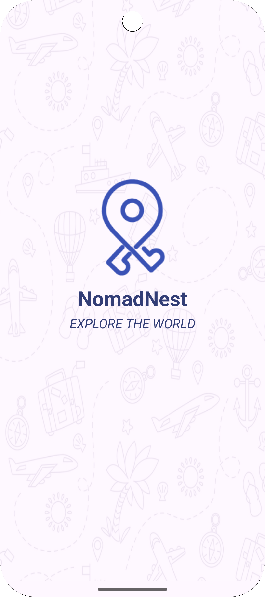</td>
    <td>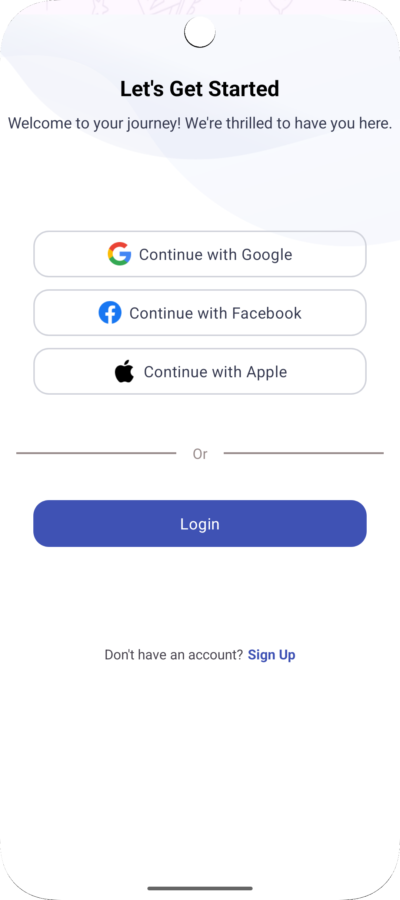</td>
    <td>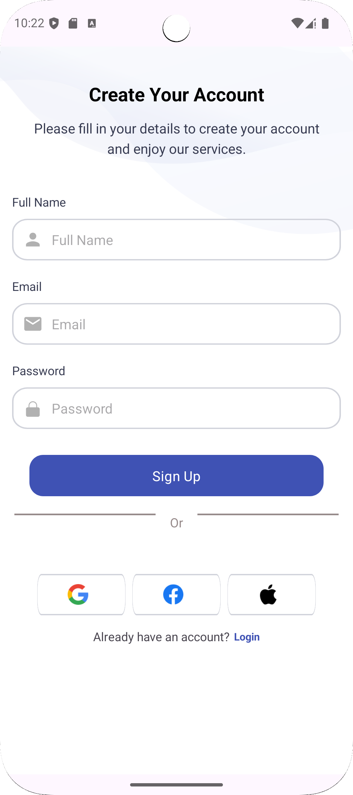</td>
    <td>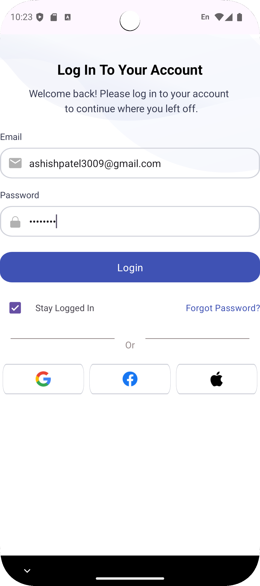</td>
  </tr>
    <tr>
    <th>Home Page 1</th>
    <th>Home Page 2</th>
    <th>Home Page 3</th>
    <th>Home Page 4</th>
  </tr>
  <tr>
    <td>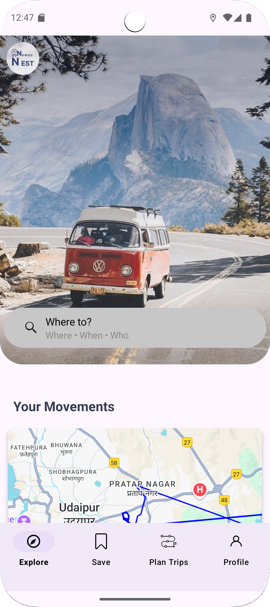</td>
    <td>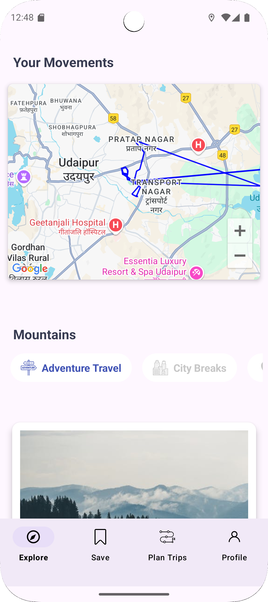</td>
    <td>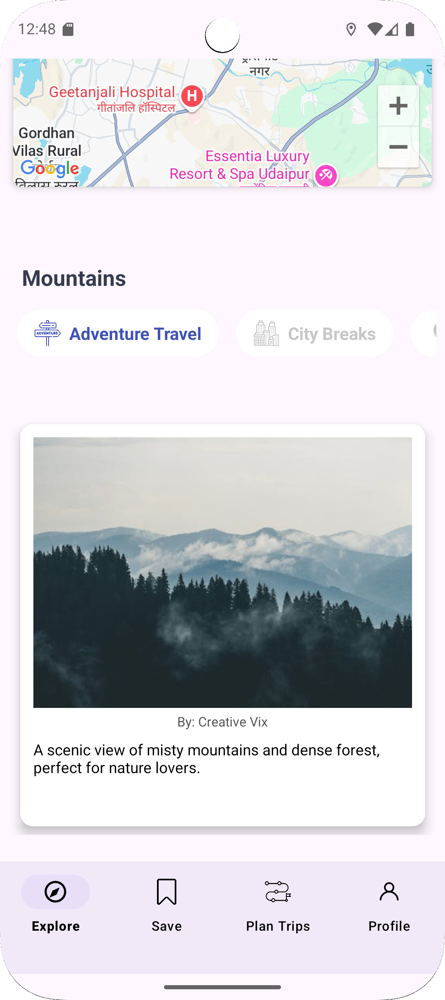</td>
    <td>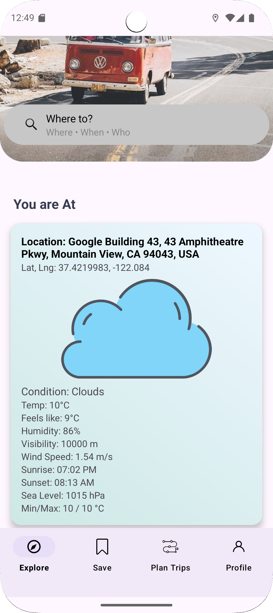</td>
  </tr>
    <tr>
    <th>Home Page 5</th>
    <th>Home Page 6</th>
    <th>Saved Page</th>
    <th>Logout</th>
  </tr>
  <tr>
     <td>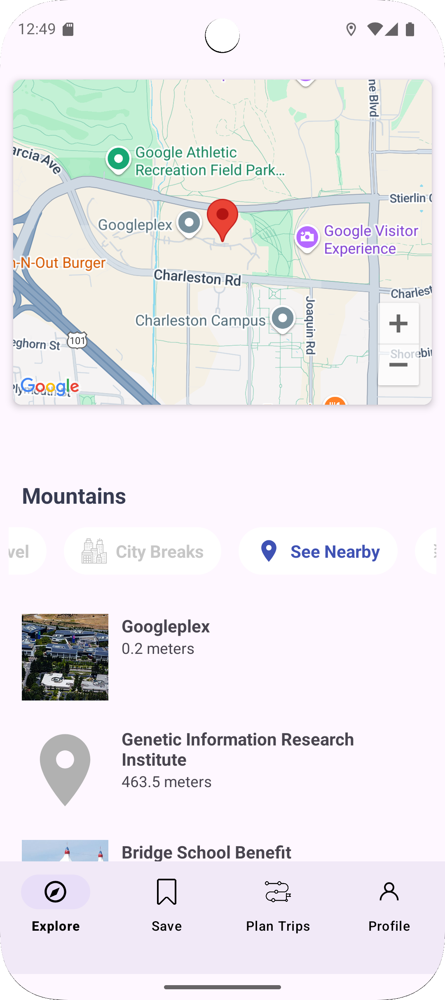</td>
    <td>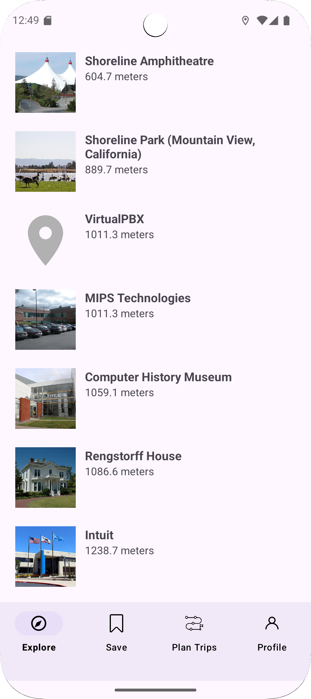</td>
    <td>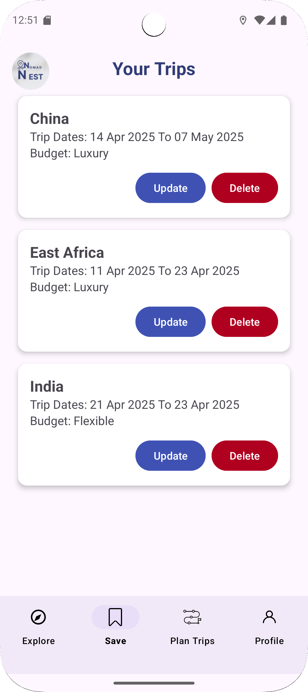</td>
    <td>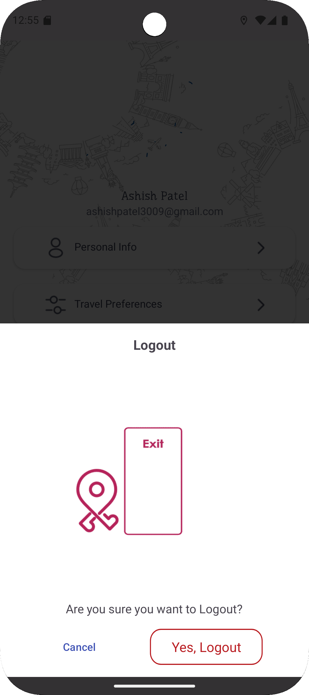</td>
  </tr>
    <tr>
    <th>Plan Trip 1</th>
    <th>Plan Trip 2</th>
    <th>Plan Trip 3</th>
    <th>Plan Trip 4</th>
  </tr>
  <tr>
    <td>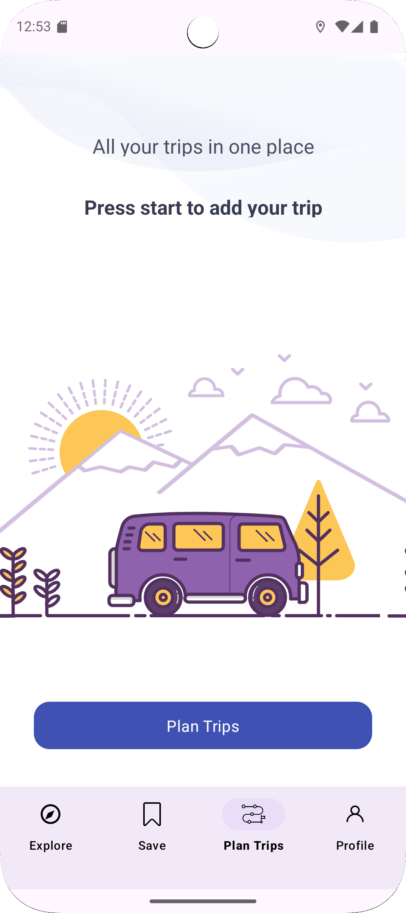</td>
    <td>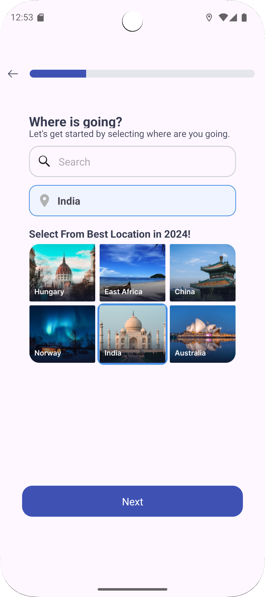</td>
    <td>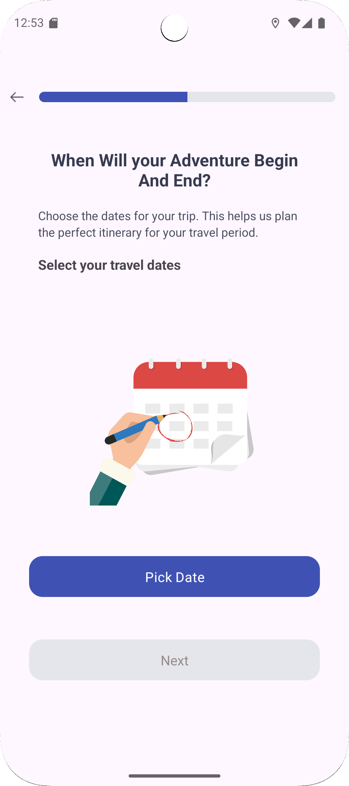</td>
    <td>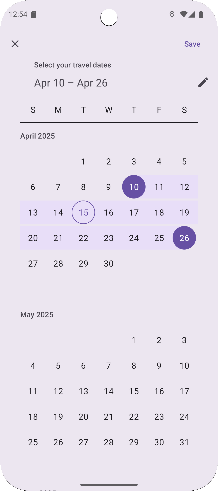</td>
  </tr>
    </tr>
    <tr>
    <th>Plan Trip 5</th>
    <th>Plan Trip 6</th>
    <th>Settings Page</th>
    <th>Personal Info Page</th>
  </tr>
  <tr>
    <td>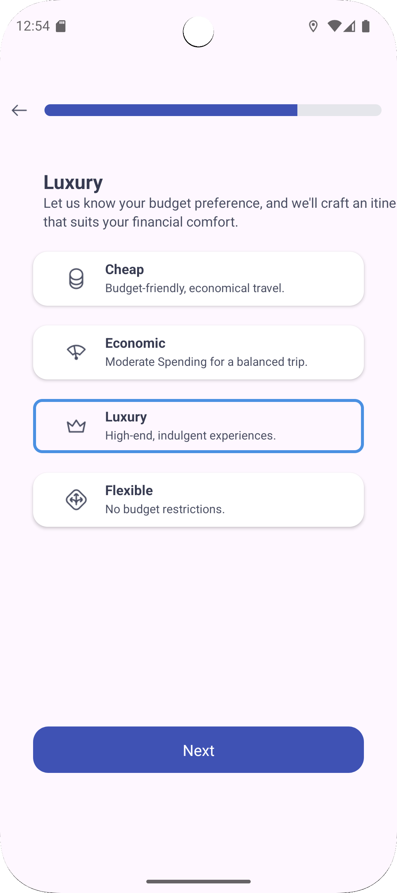</td>
    <td>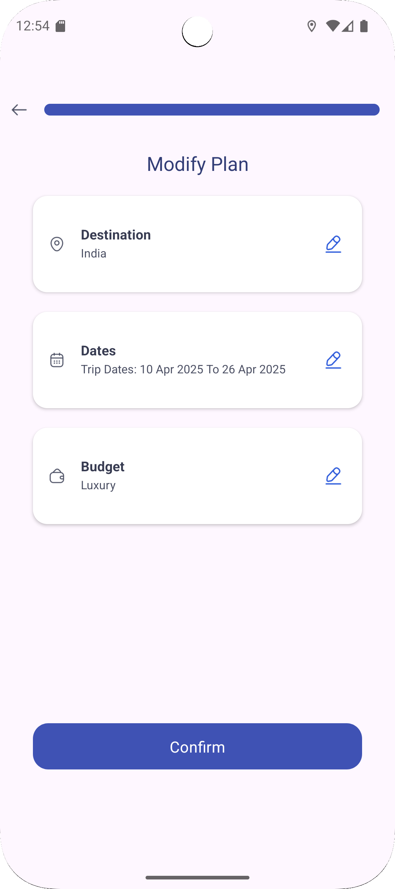</td>
    <td>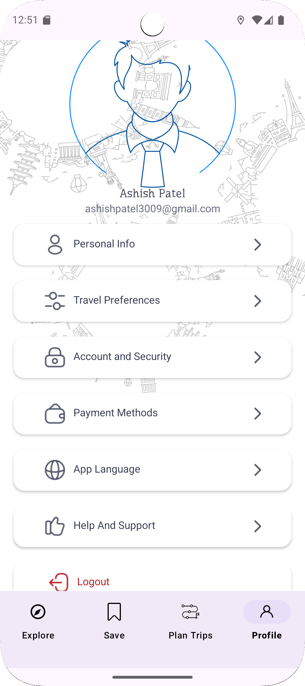</td>
    <td>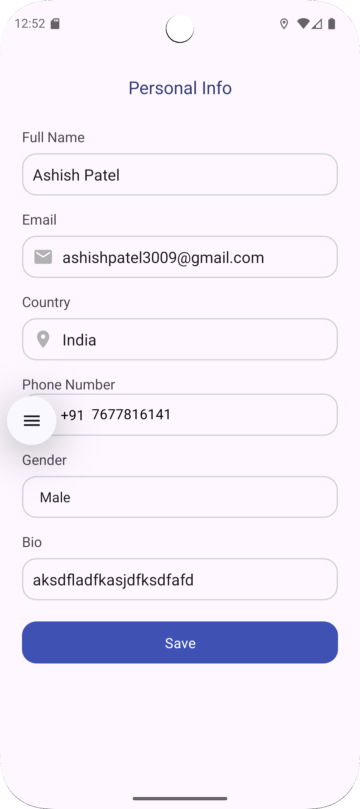</td>
  </tr>
</table>

---

## 🧪 How to Run

1. Clone the repository
   ```bash
   git clone https://github.com/meashishpatel/NomadNest

2. Open the project in Android Studio.

3. Add your Firebase config files (google-services.json) to the app/ directory.

4. Set up your API keys for: Google Maps

5. OpenWeatherMap API

6. Build and run the app on your device or emulator.


